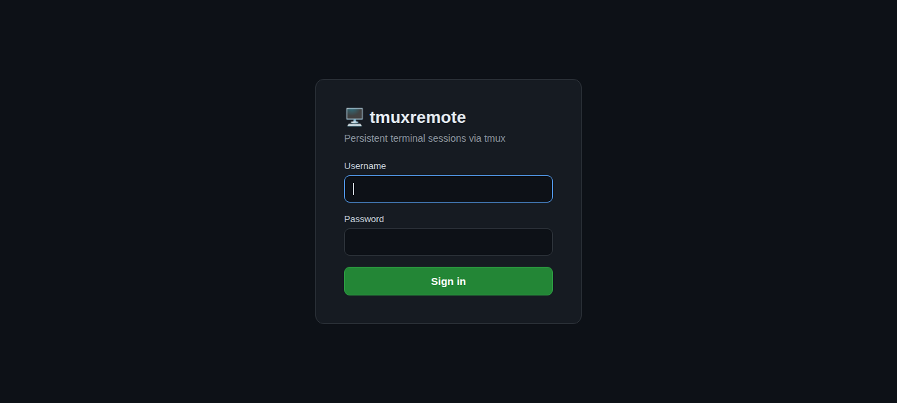
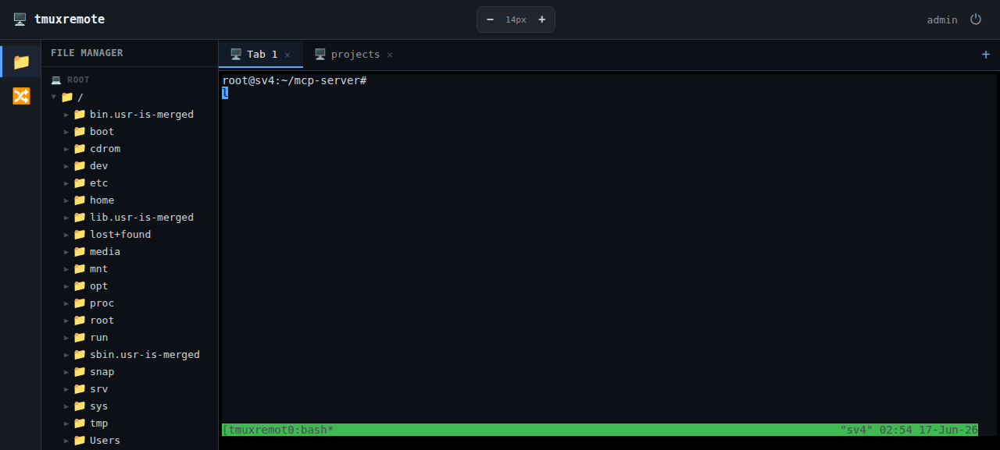
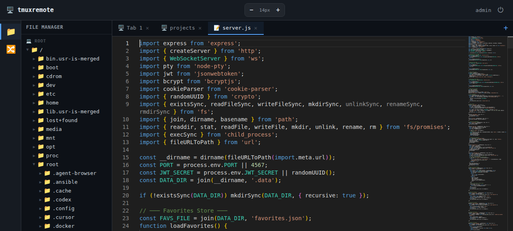

# 🖥️ tmuxremote

A web-based persistent terminal powered by [tmux](https://github.com/tmux/tmux), with a Monaco code editor, file manager, and mobile-friendly DevKeys keyboard.

Sessions persist across browser refreshes, tabs, and devices — just like tmux.



## Features

- **Persistent tmux sessions** — close your browser, come back later, your terminal is still there
- **Multiple named tabs** — create, rename, and close terminal/editor tabs
- **Monaco code editor** — click any file in the tree to open it with full syntax highlighting (JS, HTML, CSS, YAML, TOML, PHP, Python, Go, Rust, and 30+ languages)
- **Auto-save** — editor changes auto-save with 1s debounce, plus Ctrl+S
- **File manager sidebar** — browse the filesystem, expand folders, right-click for context menu
- **Favorites** — pin frequently used folders for quick access
- **Git graph** — view git log with graph for favorited repos
- **DevKeys keyboard** — mobile-friendly on-screen keyboard with Esc, Tab, Ctrl, Alt, arrows, and more (draggable, dismissible)
- **Zoom controls** — ± font size with keyboard shortcuts (Ctrl+/-/0)
- **JWT authentication** — secure login with session persistence





## Requirements

| Dependency | Version |
|-----------|---------|
| **Node.js** | ≥ 18.x (tested with 24.15.0) |
| **tmux** | any recent version |
| **npm** | comes with Node.js |

### System packages (Debian/Ubuntu)

```bash
sudo apt update && sudo apt install -y tmux build-essential python3
```

### System packages (macOS)

```bash
brew install tmux
```

> **Note:** `node-pty` requires native compilation, so `build-essential` (Linux) or Xcode CLI tools (macOS) are needed.

## Quick Start

```bash
# Clone the repo
git clone https://github.com/lequanghuylc/tmuxremote.git
cd tmuxremote

# Install dependencies
npm install

# Start the server
npm start
```

The server starts on **http://localhost:4567** by default.

### Default credentials

| Field | Value |
|-------|-------|
| Username | `admin` (configurable via `DEFAULT_USERNAME`) |
| Password | `tmuxremote` (configurable via `DEFAULT_PASSWORD`) |

> The default user is auto-created on first run.

### Configuration

#### Core

| Environment Variable | Default | Description |
|---------------------|---------|-------------|
| `PORT` | `4567` | Server port |
| `JWT_SECRET` | random UUID | Secret for JWT token signing (set this in production!) |
| `DEFAULT_USERNAME` | `admin` | Default user for password auth |
| `DEFAULT_PASSWORD` | `tmuxremote` | Default password for password auth |

#### Firebase Google Authentication (optional)

When all Firebase variables are set, password authentication is **disabled** and users sign in with Google.

| Environment Variable | Required | Description |
|---------------------|----------|-------------|
| `FIREBASE_SERVICE_ACCOUNT` | Yes | Path to Firebase service account JSON file |
| `FIREBASE_WEB_CONFIG` | Yes | Firebase web client config as JSON string (`apiKey`, `authDomain`, `projectId`) |
| `EMAIL_WHITELIST` | No | Comma-separated list of allowed emails. If not set, all Google accounts are allowed |

```bash
# Password auth (default)
npm start

# Custom credentials
DEFAULT_USERNAME=myuser DEFAULT_PASSWORD=mypass npm start

# Firebase Google auth with email whitelist
FIREBASE_SERVICE_ACCOUNT=/path/to/service-account.json \
FIREBASE_WEB_CONFIG='{"apiKey":"...","authDomain":"...","projectId":"..."}' \
EMAIL_WHITELIST="user1@gmail.com,user2@gmail.com" \
npm start
```

## Usage

### Terminal Tabs
- Click **+** to create a new terminal tab
- **Double-click** a tab name to rename it
- Click **×** to close a tab
- Each tab is a separate tmux session (`tmuxremote-<id>`)

### File Manager
- Click 📁 in the sidebar to toggle the file manager
- Click ▶ to expand folders, click a file to open it in the editor
- **Right-click** (or double-tap on mobile) for context menu:
  - Files: Open in editor, Rename, Delete
  - Folders: Open terminal here, Add to favorites, New file, New folder, Rename, Delete

### Monaco Editor
- Click any file in the file tree to open it in an editor tab
- Syntax highlighting for 30+ languages
- Auto-save (1s debounce) + Ctrl+S for immediate save
- Minimap, bracket colorization, word wrap

### DevKeys (Mobile Keyboard)
- On mobile viewports, a **⌨** button appears to toggle the DevKeys keyboard
- Keys: `^C`, `Esc`, `Tab`, `Ctrl`, `Alt`, `↑↓←→`, `Home`, `End`, `PgUp`, `PgDn`, `Ins`, `Del`, `BS`, `⌘`, `F1`-`F12`, and special characters
- **Drag** the keyboard to reposition it
- **Toggle** to expand/collapse additional key rows

### Zoom
- Use **−/+** buttons in the header to adjust font size (4px–32px)
- Keyboard: `Ctrl+-` to zoom out, `Ctrl++` to zoom in, `Ctrl+0` to reset

## Project Structure

```
tmuxremote/
├── server.js              # Express + WebSocket + tmux backend
├── public/
│   ├── index.html         # Main app (terminal + editor + sidebar)
│   ├── css/style.css      # All styles
│   └── js/app.js          # Frontend: tabs, xterm, Monaco, DevKeys, file tree
├── screenshots/           # App screenshots for documentation
├── cypress/               # E2E tests
│   └── e2e/
├── .data/                 # Runtime data (gitignored)
│   ├── users.json         # User credentials
│   ├── sessions.json      # Tab/session state
│   └── favorites.json     # Favorited paths
├── package.json
└── README.md
```

## Running with systemd (Production)

```ini
# /etc/systemd/system/tmuxremote.service
[Unit]
Description=tmuxremote web terminal
After=network.target

[Service]
Type=simple
WorkingDirectory=/path/to/tmuxremote
ExecStart=/usr/bin/node server.js
Restart=always
Environment=PORT=4567
Environment=JWT_SECRET=your-secret-here

[Install]
WantedBy=multi-user.target
```

```bash
sudo systemctl daemon-reload
sudo systemctl enable --now tmuxremote
```

## Running with Docker

```dockerfile
FROM node:24-slim
RUN apt-get update && apt-get install -y tmux build-essential python3 && rm -rf /var/lib/apt/lists/*
WORKDIR /app
COPY package*.json ./
RUN npm ci --production
COPY . .
EXPOSE 4567
CMD ["node", "server.js"]
```

```bash
docker build -t tmuxremote .
docker run -d -p 4567:4567 --name tmuxremote tmuxremote
```

## Development

```bash
# Install dev dependencies (includes Cypress)
npm install

# Run E2E tests
npx cypress run

# Run tests with visible browser
npx cypress open
```

## Security Notes

- Change the default password immediately after first login
- Set a strong `JWT_SECRET` in production
- Use a reverse proxy (nginx/caddy) with HTTPS for production deployments
- The server binds to `0.0.0.0` by default — firewall as needed

## License

ISC
